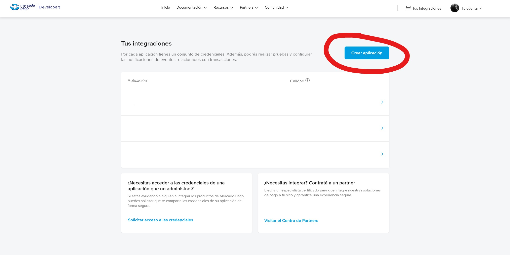
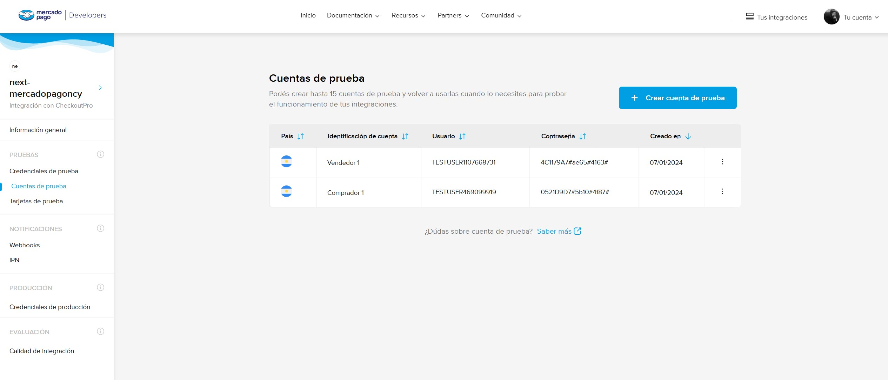

# Configuración de Mercado Pago

En este documento vamos a ver como configurar una integración de Mercado Pago, crear las cuentas de prueba y dejar todo listo para poder implementar las distintas formas de pago que vamos a usar.

## Indice

1. [Crear una integración en Mercado Pago](#crear-una-integración-en-mercado-pago)
2. [Crear las cuentas de prueba de vendedor y comprador](#crear-las-cuentas-de-prueba-de-vendedor-y-comprador)
3. [Crear una integración con la cuenta de prueba vendedor](#crear-una-integración-con-la-cuenta-de-prueba-vendedor)

## Crear una integración en Mercado Pago

Vamos a ir a [Mercado Pago Developers](https://www.mercadopago.com.ar/developers/panel/app) y creamos una nueva aplicación.

Una vez dentro, cargamos todos los datos de nuestra aplicación. En "¿Qué producto estás integrando?" vas a elegir el que quieras integrar. Una vez creada la aplicación vamos a ser redirigidos a la pantalla de integración.

> [!IMPORTANT]
> Si vas a implementar `Checkout Bricks` no es necesario crear una cuenta de prueba ya que *debes* usar las credenciales de prueba de una cuenta real. Podés dirigirte a `Credenciales de prueba` y copiar las credenciales a tu archivo `.env.local`.

## Crear las cuentas de prueba de vendedor y comprador

Vamos a ir `Cuentas de prueba` en el menú izquierdo y creamos tres cuentas nombradas algo así como `Comprador` y `Vendedor`. A cada una le asignamos el país donde queremos operar y un dinero inicial.

> [!WARNING]
> Las cuentas de prueba no se pueden borrar y son válidas para todas las aplicaciones.

> [!TIP]
> En caso de querer implementar `Marketplace` podés crear una tercer cuenta de prueba llamada `Intermediario` ya que tres partes van a interactuar en ese proceso.

## Crear una integración con la cuenta de prueba vendedor

Ya que nuestra cuenta original de Mercado Pago solo puede manejar pagos reales, vamos a tener que crear una nueva aplicación (como hicimos recientemente) logueandonos con la cuenta de prueba vendedor.

No te preocupes, la aplicación que creamos originalmente es la que vamos a usar para manejar los pagos reales una vez que terminemos de desarrollar y probar la aplicación.

Vamos a abrir la [página de desarrolladores de Mercado Pago](https://www.mercadopago.com.ar/developers/panel/app/) una ventana de incognito y loguearnos en la cuenta de prueba vendedor con el usuario y contraseña correspondientes y creamos una aplicación con los mismos datos (y otro nombre) que la aplicación original.

> [!TIP]
> Yo siempre recomiendo usar el mismo nombre que la aplicación original pero agregando `-vendedor` o `-comprador` al final para poder distingir ambas aplicaciones.

Después nos vamos a dirigir a `Credenciales de producción` (como es una cuenta de prueba, producción es prueba) y nos copiamos el `Public Key`, `Access Token`, `Client ID` y `Client Secret` y lo pegamos en nuestro archivo `.env.local`.

> [!IMPORTANT] Recordá que los valores públicos, como `Public Key` o `Client ID` deben ser prefijados con `NEXT_PUBLIC_` para poder ser usados en el frontend (por ejemplo: `NEXT_PUBLIC_MP_CLIENT_ID` y `NEXT_PUBLIC_MP_PUBLIC_KEY`).

> [!NOTE]
> No vamos a necesitar todos los valores para todas las integraciones pero no esta mal que los guardemos por las dudas.

---

[Volver al inicio](../README.md)
